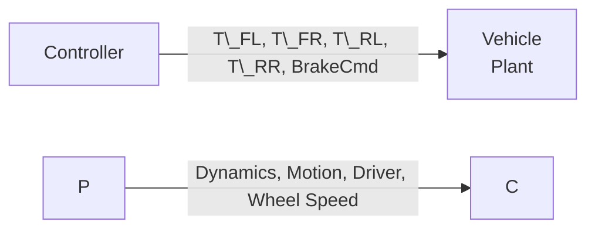

# PlanarModelandControl

Closed-loop planar vehicle dynamics Simulink model (4-wheel) featuring the full Pacejka tire model, Direct Yaw Control (DYC), torque vectoring, and per-wheel fuzzy traction control.

Complete technical documentation (mathematical model, assumptions, validation, and case studies): see **`Technical\_Report.md`**.

## Structure



* **Controller** — Cornering Stiffness, Stability Gradient, Direct Yaw Control (DYC), Torque Vectoring, Traction Control (4× Fuzzy Logic Controllers).
* **Plant** — Driver (maneuver profile + speed PID), Wheel Dynamics, Pacejka Tire Model (Magic Formula Fx/Fy), Friction Ellipse, Braking, Relaxation Length, Vehicle Motion.

Sampling time: **Ts = 0.001 s (1 kHz)**, operating in `accelerator` mode.

## Running the Model

1. Open MATLAB in the project root directory (where `PlanarModel\_Jetson\_v2.slx` is located).
2. Open `PlanarModel\_Jetson\_v2.slx`. The model `InitFcn` automatically loads all parameters and lookup tables when the model is opened.
3. Before running the simulation, define the following variables in the MATLAB workspace (using `assignin('base', ...)` in scripts or manually):

   * `Steer\_Cmd`, `Accel\_Cmd`, `Brake\_Cmd` — time series in the format `\[time, value]`
   * `Vx\_init`, `Vx\_Ref` — initial vehicle speed and reference speed (cruise control)
   * `Flag\_CruiseControl` — 0/1, enables or disables the speed PID controller in the `Driver`
   * `Controles\_Ativos` — 0/1, enables or disables the entire control package (DYC + Traction Control). Useful for comparing the vehicle behavior with and without the control systems during the same maneuver.
4. Run the simulation directly from Simulink or programmatically using the maneuver scripts described below.

### Dependencies

* MATLAB/Simulink R2024a (or compatible version)
* Fuzzy Logic Toolbox (required for the Traction Control blocks)
* `Parameters.m`, `curva\_steering.m`, and `curva\_tq\_motor.m` available in the MATLAB path

## Analysis Scripts

|Script|Description|
|-|-|
|`TesteGGv2.m`|Generates the G-G diagram (lateral vs. longitudinal acceleration envelope) for a given speed by sweeping acceleration, braking, and cornering maneuvers (pure and combined), extracting the tire grip boundary by angular sector.|
|`StepSteer.m`|Step steer response analysis — evaluates steady-state yaw gain and overshoot relative to the DYC reference while sweeping vehicle speed and steering amplitude.|
|SineWithDwell.m`|Standard lateral stability maneuver (based on FMVSS 126) with automatic PASS/FAIL evaluation based on yaw rate recovery criteria.|
|`Acc.m`|0–75 m acceleration test comparing vehicle performance with fuzzy Traction Control enabled and disabled (`Controles\_Ativos`).|

For a detailed description of the methodology and results of each test, see Section 8 of **`Technical\_Report.md`**.

`\[TODO: Additional scripts will be included as they are developed.]`

## Suggested Project Structure

```
/model/PlanarModelandControl.slx
/params/Parameters.m, curva\_steering.m, curva\_tq\_motor.m
/scripts/TesteGGv2.m, ...
/docs/Technical\_Report.md
/results/  (figures, validation .mat files)
```

## Glossary

* **Yaw:** Rotation of the vehicle about its vertical axis.
* **DYC (Direct Yaw Control):** Control strategy used to improve vehicle stability and prevent skidding.
* **Torque Vectoring:** Intelligent distribution of drive torque among the wheels.
* **Traction Control (Fuzzy):** Fuzzy logic-based traction control during acceleration.
* **Pacejka / Magic Formula:** Mathematical tire model used to predict tire force behavior.
* **Friction Ellipse:** Physical tire grip limit considering combined longitudinal and lateral forces.
* **Relaxation Length:** Distance traveled by the tire before the generated forces fully develop following a slip change.

